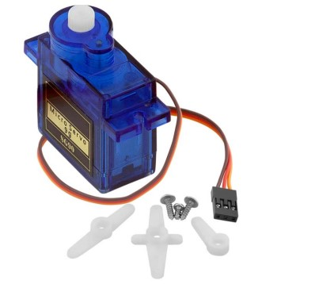
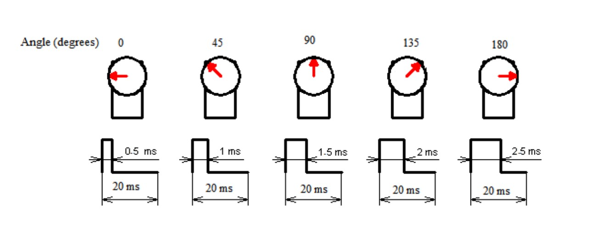

## Task 20: Interfacing a Servo Motor with the STC89C52 Microcontroller

This task involves interfacing an SG90 servo motor with the STC89C52 microcontroller. The servo motor requires a precise PWM signal to control its movement from 0 to 180 degrees. Follow the steps below to generate the required PWM signals and control the servo motor.

#### Step 1: Learn the Basics of Servo Motor Operation
- **Watch the video**: [Servo Motor Working](https://www.youtube.com/watch?v=1WnGv-DPexc&ab_channel=TheEngineeringMindset) to understand how a servo motor operates.

#### Step 2: Generate a Basic PWM Signal in a While Loop
- The SG90 servo motor requires a 50 Hz PWM signal, meaning a signal must be sent every 20 milliseconds. 
- In this step, we will generate the PWM signal in a continuous while loop.
- For a basic PWM signal to move the servo to 0 degrees, output the following logic:
  1. Set the GPIO pin to HIGH.
  2. Introduce a delay of **0.5 ms** (500 µs).
  3. Set the GPIO pin to LOW.
  4. Introduce a delay of **19.5 ms**.
- The total time for one PWM cycle (HIGH + LOW) is 20 ms, corresponding to 50 Hz.
- Check the generated PWM signal using a logic analyzer or oscilloscope.
  
To move the servo to different angles:
- Increase the HIGH signal duration:
  - **1 ms HIGH + 19 ms LOW** will rotate the servo to **45 degrees**.
  - **1.5 ms HIGH + 18.5 ms LOW** will rotate the servo to **90 degrees**, and so on.

**Note**: This basic method can cause timing inaccuracies if more code is added to the program.

#### Step 3: Improving Timing Accuracy with Timer Interrupts
To avoid timing issues and achieve better precision, use a timer interrupt to generate the PWM signal.

- Configure a timer interrupt with a faster resolution, e.g., every **11.11 µs**. This resolution is calculated based on the pulse width needed to move the servo from 0 to 180 degrees:
  - **500 µs** corresponds to 0 degrees.
  - **2500 µs** corresponds to 180 degrees.
  - To move by 1 degree, the pulse width changes by **11.11 µs**.
  
- Create a variable named `servo_position` (range: 0–180 degrees), initialized to **0**.
- Use two buttons, **K1** and **K2**:
  - Pressing **K1** decreases the `servo_position` value, moving the servo towards 0 degrees.
  - Pressing **K2** increases the `servo_position` value, moving the servo towards 180 degrees.

#### Step 4: Generate PWM Signal in the Timer Interrupt
- Use the timer interrupt to control the GPIO pin based on the value of the `servo_position` variable.
- Calculate how many timer ticks are needed to keep the GPIO pin HIGH and LOW:
  - Example: If `servo_position = 45`, the GPIO pin should be HIGH for **45 timer ticks** (45 x 11.11 µs).
  
- Ensure the total time for the PWM signal (HIGH + LOW) remains **20 ms** (50 Hz).
- Display the current `servo_position` on a **seven-segment display** or **LCD**.

#### Step 5: Testing and Demonstration
- Connect the PWM signal generated from the microcontroller to the servo motor.
- Demonstrate the movement of the servo motor from 0 to 180 degrees using the **K1** and **K2** keys.
- Ensure the ground of the servo motor is properly connected to the ground of the STC89C52 microcontroller board.
- Use a logic analyzer or oscilloscope to verify the PWM signal.

---
